# Financial Management System

## Overview
The **Financial Management System** is a Django-based web application designed to help users manage their **expenses, income, budgeting, bill payments, and transactions** efficiently. The system provides an intuitive dashboard with automated features to track financial activities seamlessly.

## Features
- **Expense Tracking**: Categorize and analyze spending trends.
- **Income Management**: Record multiple income sources.
- **Budgeting**: Set monthly/weekly budgets and receive alerts.
- **Bill Management**: Schedule, track, and automate bill payments.
- **Automation**: AI-driven spending insights, auto-categorization, and recurring transactions.
- **User Authentication**: Secure login and registration.
- **Dashboard Analytics**: Graphical representation of financial health.

## Tech Stack
- **Backend**: Django, PostgreSQL
- **Frontend**: React.js, Tailwind CSS
- **Authentication**: JWT, OAuth
- **APIs & Integrations**: Stripe/PayPal, Plaid (bank sync)
- **Automation**: Celery, Redis

## Installation
### Prerequisites
- Python 3.x
- Django
- PostgreSQL
- Node.js & npm (for frontend)

### Steps
1. Clone the repository:
   ```sh
   git clone https://github.com/yourusername/FinancialManagementSystem.git
   cd FinancialManagementSystem
   ```
2. Install dependencies:
   ```sh
   pip install -r requirements.txt
   ```
3. Run migrations:
   ```sh
   python manage.py migrate
   ```
4. Start the Django server:
   ```sh
   python manage.py runserver
   ```
5. Navigate to `http://127.0.0.1:8000/`

## Screenshots
### **Homepage**
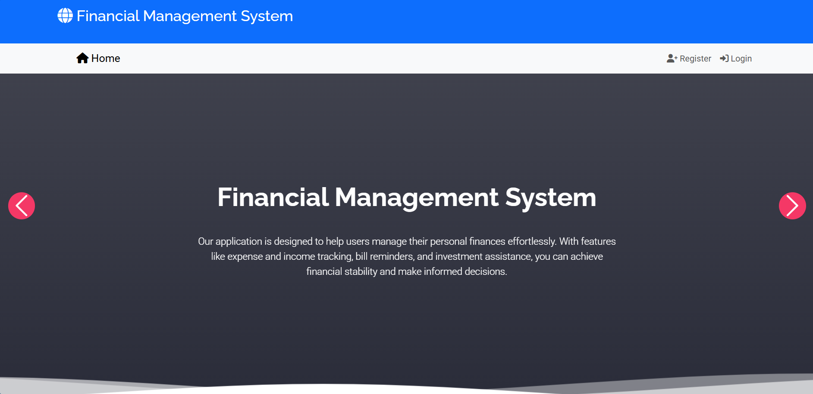

### **Dashboard**
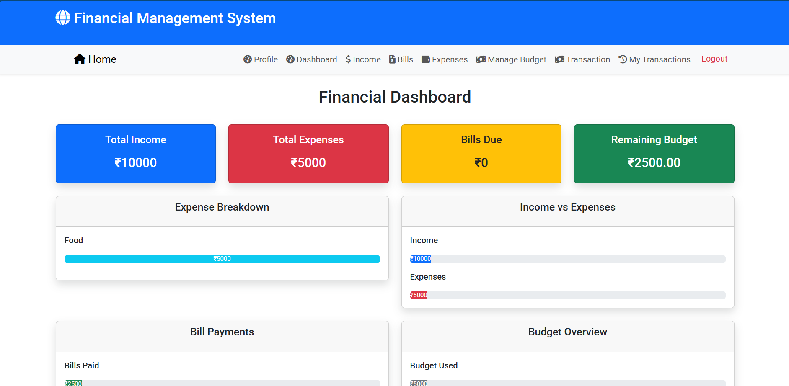

### **Login Page**
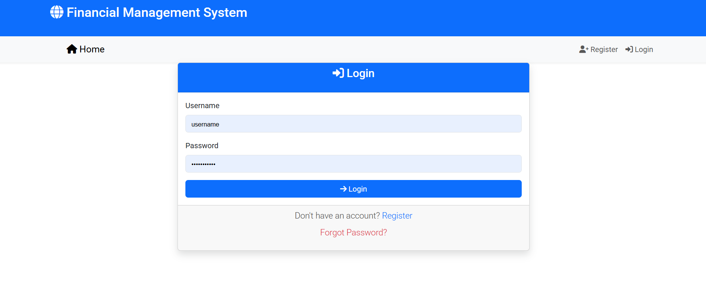

### **Register Page**
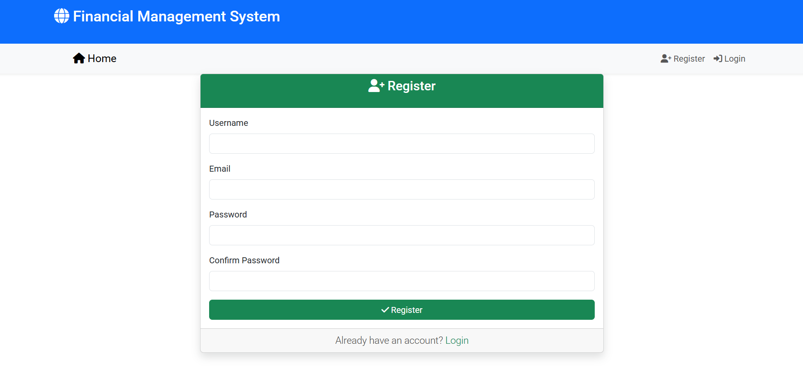

### **My Profile**
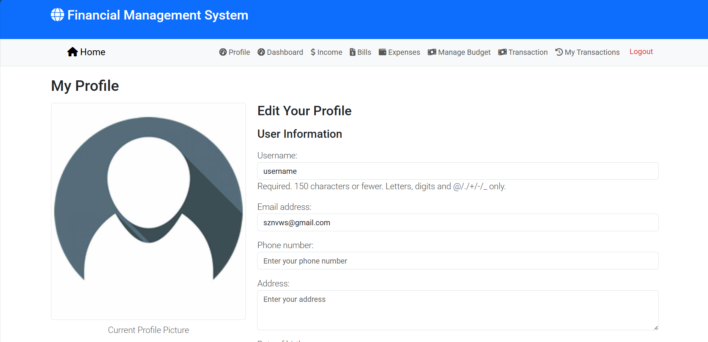

### **Expenses Page**
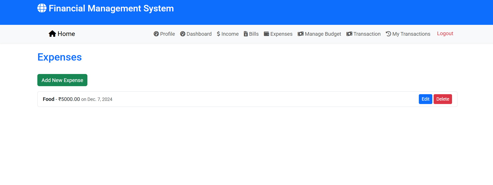

### **Income Page**
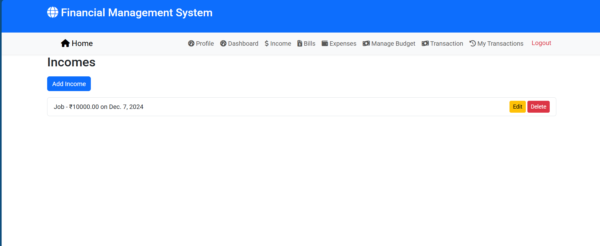

### **Add Income**
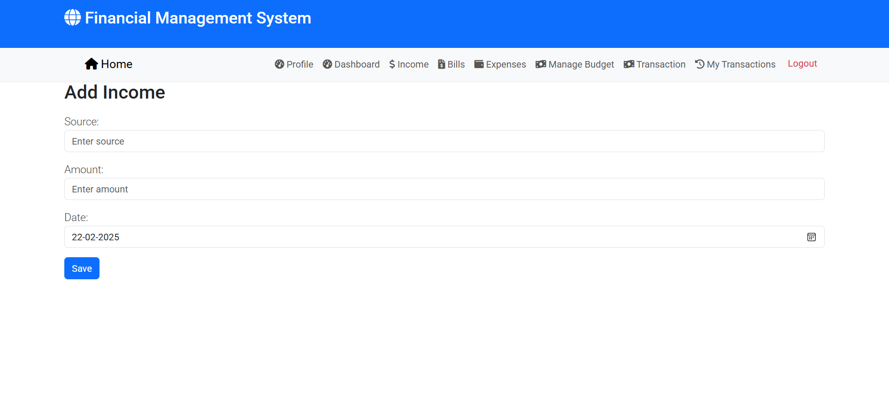

### **Add Expenses**
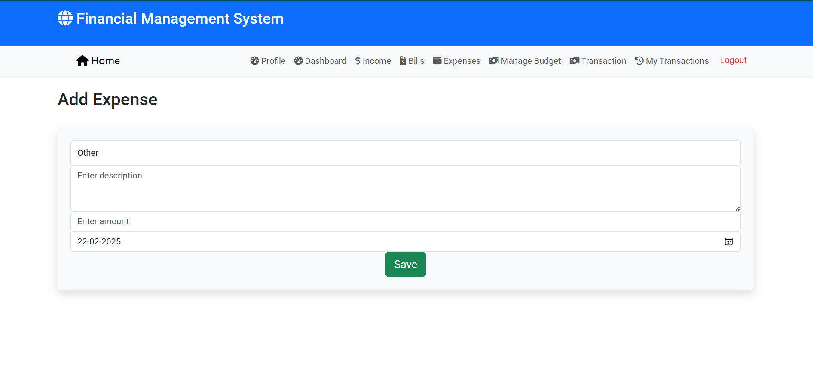

### **Add Bill**
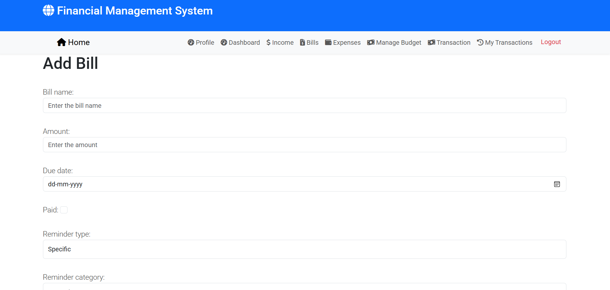

### **Bill Payments**
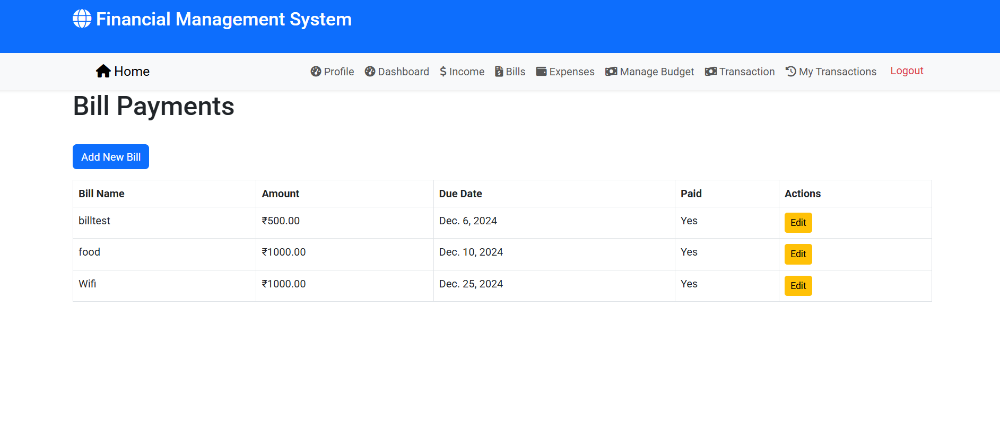

### **Budgeting**
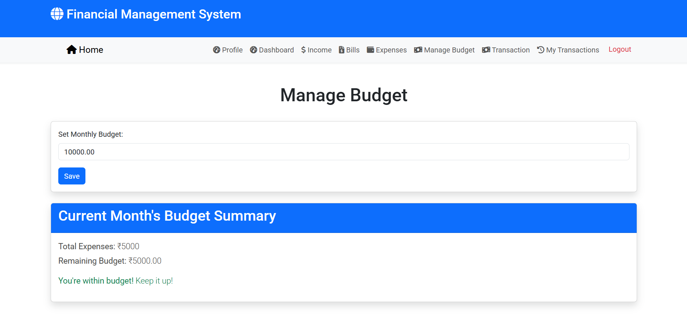

### **Transactions**
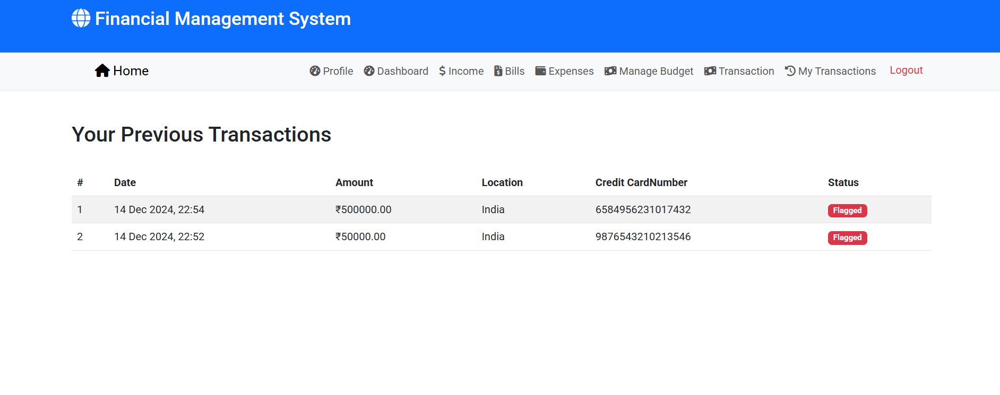

### **Add Transaction**
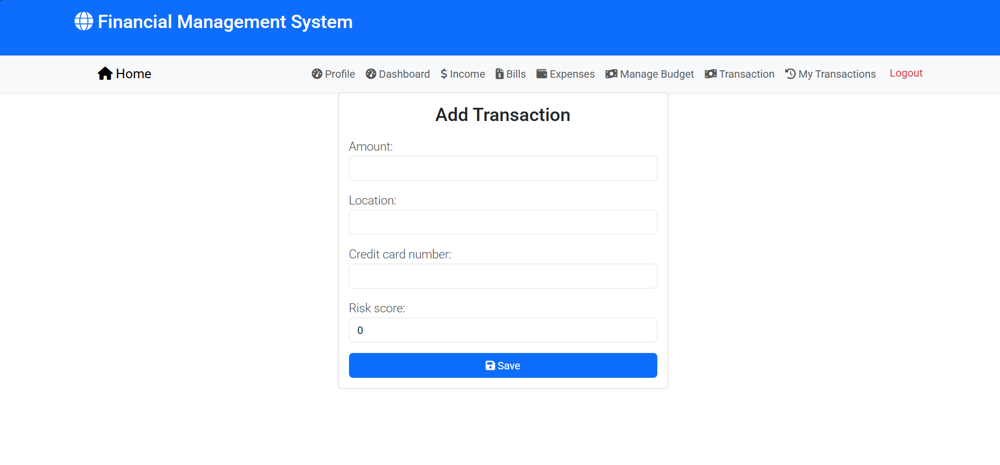

### **Index Page**
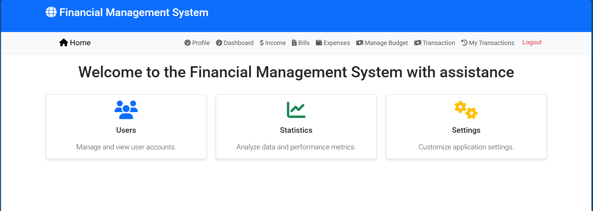

## License
This project is licensed under the MIT License.

## Contact
For queries or suggestions, reach out at ....

